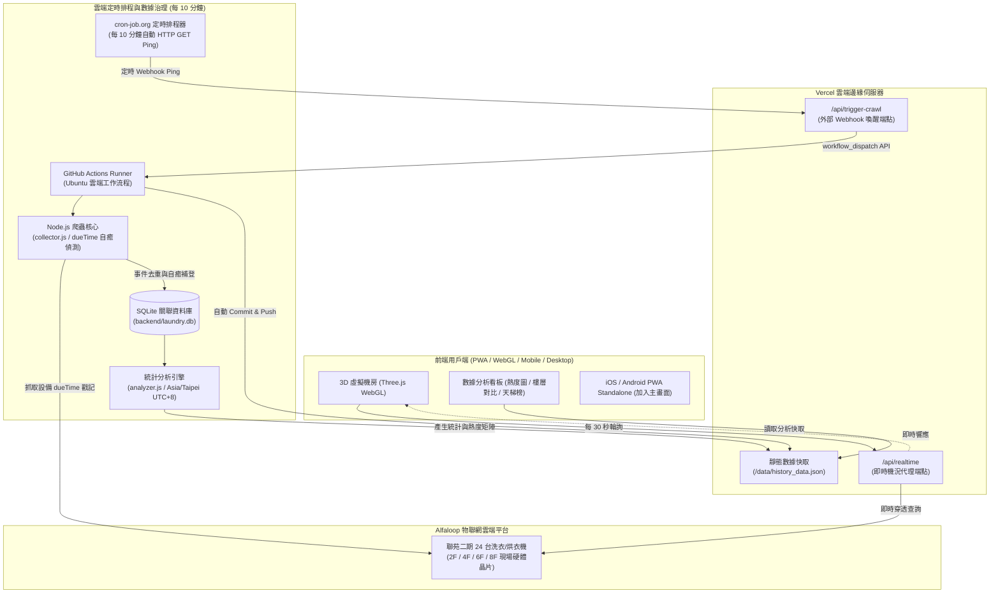

# 聯苑宿舍二期 · 3D 洗衣監控分析系統 (UMC-3D-WasherMonitor)

> **24H 物聯網即時監控 · 3D 擬真機房 · 大數據規律熱度圖 · 離峰洗衣智慧推薦**

- **專案名稱**：`UMC-3D-WasherMonitor`
- **線上站點**：[https://umc-3d-washermonitor.vercel.app](https://umc-3d-washermonitor.vercel.app)
- **最新版本**：`v2.4.0` (Release 2026.09.13)
- **維護聲明**：看我心情~和下班有沒有空
- **版權宣告**：Copyright © 2026 UMC_IT-Jimmy

---

## 🏗️ 系統全景架構圖 (Architecture)

本系統採用**雙軌分離架構（即時動態流 + 大數據批次流）**，兼顧「秒級即時監控的高靈敏度」與「長期規律分析的容錯高可靠性」：



---

## ⚡ 核心雙軌運作機制

### 1. 軌道一：即時 3D 機況流 (Real-Time Pipeline)
- **觸發頻率**：前端預設每 30 秒自動向 `/api/realtime` 輪詢一次（或點擊右上方手動刷新）。
- **轉發與代理**：透過 Vercel Serverless Function 轉發請求至 Alfaloop IoT 伺服器，解決瀏覽器端 CORS 跨域限制，並對原始 JSON 進行資料清洗。
- **視覺渲染**：
  - 🟢 **閒置可使用**：常態微光綠環，提示隨時可投幣。
  - 🟠 **運轉中**：高亮琥珀橘脈衝呼吸環、滾筒動態轉動、每秒精確倒數結束時間。
  - ⚪ **離線**：灰暗狀態，提示未開機或維護中。

---

### 2. 軌道二：大數據分析與自癒排程流 (Batch & Self-Healing Pipeline)
- **定時喚醒機制**：
  - 採用 **`cron-job.org`** 外部 Webhook 服務，每 10 分鐘自動對 `/api/trigger-crawl` 發送 HTTP GET Ping。
  - Vercel API 收到後透過 GitHub REST API 即時觸發 GitHub Actions 工作流程（`workflow_dispatch`），**5~8 秒內即時喚醒爬蟲**，徹底擺脫 GitHub 自身 cron 佇列在尖峰期延遲或被丟棄的限制。
- **基於硬體 dueTime 戳記的自我修復補登**：
  - 即使雲端排程中斷數小時，機台硬體端洗完後仍會保留最後一次運轉的 `dueTime` 戳記。
  - 爬蟲再次啟動時，會自動比對資料庫歷史，若偵測到新的結束時間戳記，**自動回溯起始時間與金額補登入 SQLite 資料庫**，達成離線自癒容錯。
- **時區統一治理 (Asia/Taipei UTC+8)**：
  - 分析核心內建台灣時區座標轉換函式，消除 GitHub Actions 預設 Ubuntu UTC+0 環境帶來的 8 小時偏差，確保熱度矩陣的 24 小時時段完全精確。
- **物理分母容量模型 (Physical Capacity Denominators)**：
  - **全棟分析**：以全棟 24 台（洗衣機 16 台、烘衣機 8 台）為物理容量上限，熱度圖支援「洗烘合併 / 洗衣機 / 烘衣機」三種分母切換。
  - **樓層分析**：單層樓標準配備 4 台洗衣機 + 2 台烘衣機（共 6 台），洗機分母為 4，烘機分母為 2，真實反映物理滿載率。
  - **機台分析**：單機分母為 1，改採「機台行為畫像」：同類熱門度天梯排行、平均單次時長、尖峰常滿時段 Top 3、合法最佳空閒推薦與 24H 被佔用機率走勢。
- **生活公約安寧規範合規 (08:00 ~ 24:00 合法時段)**：
  - 嚴格限定離峰推薦時段計算於 **08:00 ~ 24:00** 之間，自動排除 00:00 ~ 08:00 夜間安寧禁洗區間。
  - 熱度矩陣與走勢圖將 00:00 ~ 08:00 特別標註 `🌙 夜間安寧禁洗`，半夜使用自動以 `⚠️ 違規偷用` 標記。
- **冷門機台健康度過濾**：
  - 離峰冷門推薦機台嚴格過濾斷線或故障機台，確保推薦的皆為在線正常運作之設備。

---

## 📁 專案目錄結構

```text
UMC-3D-WasherMonitor/
├── .github/
│   └── workflows/
│       └── crawl.yml           # GitHub Actions 10 分鐘爬蟲工作流程
│
├── api/                        # Vercel Serverless Functions 根端點
│   ├── realtime.js             # 即時機況代理端點
│   └── trigger-crawl.js        # 外部 Webhook 爬蟲喚醒端點
│
├── backend/                    # 爬蟲與 SQLite 歷史庫後端
│   ├── collector.js            # Alfaloop IoT 爬蟲與事件偵測
│   ├── analyzer.js             # 台灣時區熱度矩陣、樓層對比與天梯榜計算
│   ├── export_data.js          # 將 SQLite 資料庫匯出為前端靜態 JSON
│   ├── db.js                   # Node.js 原生 SQLite 連線與資料表結構 (DatabaseSync)
│   ├── daemon.js               # 本機 24H 背景守護程式 (每 3 分鐘)
│   └── start_daemon.bat        # Windows 一鍵啟動守護腳本
│
├── frontend/                   # 現代化 3D 前端與 PWA
│   ├── index.html              # 主畫面 (3D Canvas + 直立式樓層選單 + 版本資訊)
│   ├── manifest.json           # PWA Web App 清單 (支援 iOS 加入主畫面)
│   ├── sw.js                   # Service Worker (離線快取與 Network-First 策略)
│   ├── api/                    # 前端同步 Serverless 端點
│   ├── public/data/
│   │   ├── realtime_latest.json # 最新即時機況快照備份
│   │   └── history_data.json    # 歷史大數據規律與熱度圖分析檔
│   └── src/
│       ├── main.js             # 前端核心邏輯、視角導航、資料同步
│       ├── three/
│       │   └── LaundryScene.js # Three.js 3D 空間建模、材質光影、相機推軌與動畫
│       └── components/
│           └── Charts.js       # Chart.js 視覺化、每週熱度矩陣看板
│
├── vercel.json                 # Vercel 建置與路由配置
└── README.md                   # 系統架構與說明文件
```

---

## 🎯 現場機房空間對應 (2F / 4F / 6F / 8F)

現場各樓層機房皆為單排一字型排列，**進門視角由右至左**配置如下：

| 位置 (由右至左) | 設備名稱 | 設備類型 | 預設運轉參數 |
|---|---|---|---|
| **第 1 台（靠門）** | 洗衣機 1 號 | 水洗脫水機 | 投幣 NT$ 20 / 40 分鐘 |
| **第 2 台** | 洗衣機 2 號 | 水洗脫水機 | 投幣 NT$ 20 / 40 分鐘 |
| **第 3 台** | 洗衣機 3 號 | 水洗脫水機 | 投幣 NT$ 20 / 40 分鐘 |
| **第 4 台** | 烘衣機 1 號 | 熱風烘乾機 | 投幣 NT$ 10 / 20 分鐘 (可累投至 99 分鐘) |
| **第 5 台** | 烘衣機 2 號 | 熱風烘乾機 | 投幣 NT$ 10 / 20 分鐘 (可累投至 99 分鐘) |
| **第 6 台（最內側）**| 洗衣機 4 號 | 水洗脫水機 | 投幣 NT$ 20 / 40 分鐘 |

*(全棟 4 個樓層共 24 台聯網設備，完整納入 3D 視覺化與規律統計)*

---

## 📜 版本演進歷史

- **`v2.4.0` (2026.09.13)**
  - **視角分類重新排序**：依使用習慣調整按鈕由左至右為「by全棟 ➔ by樓層 ➔ by機台」，預設直覺進入全棟總覽。
  - **熱度矩陣物理分母重構**：全面導入洗烘分離分母切換（樓層洗4/烘2/合6、全棟洗16/烘8/合24），告別空泛比例。
  - **生活公約安寧規範嚴格合規**：夜間 00:00~08:00 嚴禁洗烘，半夜違規偷洗以 ⚠️ 標記；智慧空閒離峰推薦時段嚴格限定在 08:00~24:00 合法營運時段。
  - **單機行為畫像取代分母為1的熱度圖**：提供同類熱門度天梯排行、平均單次時長、尖峰常滿 Top 3、最佳空閒推薦與 24H 被佔用機率走勢。
  - **冷門機台健康度過濾**：自動過濾離線與故障機台，避免誤推斷線機台為最佳推薦。
- **`v2.3.0` (2026.09.13)**
  - 串接 `cron-job.org` 外部 Webhook，徹底解決 GitHub Actions 尖峰排程延遲問題。
  - 全面校準數據分析熱度圖時區為台灣時間（Asia/Taipei UTC+8），消除 8 小時時差。
  - 數據分析頂部新增「cron-job.org 定時自動爬蟲數據更新」與「雲端爬蟲更新次數」。
  - 新增 Vercel Serverless `/api/trigger-crawl` 橋接端點，支援外部即時喚醒爬蟲。
  - 自癒補登機制驗證：離線間隔自動精準追蹤並補登 21 筆歷史洗衣/烘衣事件。
- **`v2.2.1` (2026.09.13)**
  - 後牆樓層標示上移外移（x=±8.9, y=3.85），微縮適配紅框角落空間。
  - 左側樓層告示全面放大 35%（x=-12.4, y=2.2），高解析重繪更顯眼。
  - 手機版 i 按鈕獨立移至右上方，與直立式樓層選單保持安全間距。
  - 手機版頂部標題字體顯著加大（粗黑體 15px/18px），清晰易讀。
- **`v2.2.0` (2026.09.13)**
  - 補齊手機頂部標題「聯苑二期3D洗衣監控分析」。
  - 徹底解決 Safari 報表關閉鈕 (X) 遮蔽與 iOS 安全區適配。
  - 機台選取視角中心下移，機台與倒數看板完美避開資訊小窗。
  - 全棟視角微縮並導入微微俯瞰視角，層次更完美。
  - 底部選單防折行與防跑版調優，全面鎖定單行排版。
- **`v0.0.9 beta` (2026.09.12)**
  - 專案初衷發軔：因為太討厭每週下班搶洗衣機，索性開始實驗逆向分析這棟樓的洗衣機 IoT API 傳輸方式，預計做長期分析與數據收集，目標是要改善下班洗衣效率和學習 AI 工具開發。
